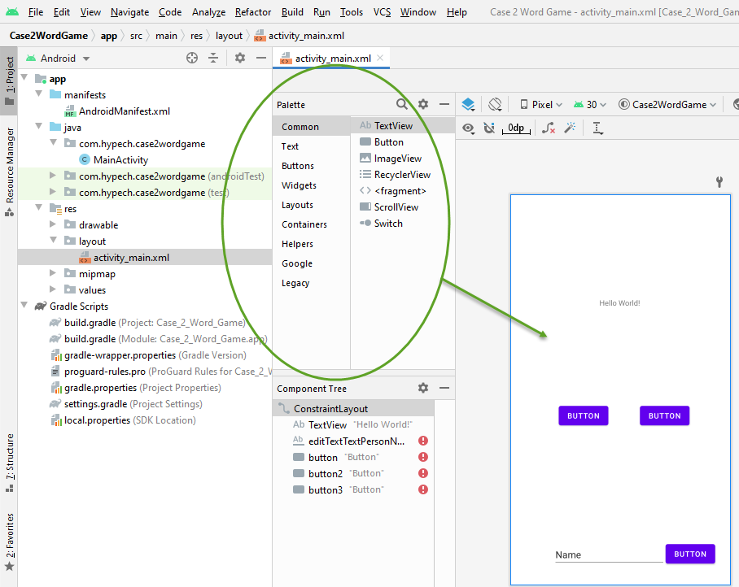

  

# Case2_WordGame

Android Studio enables us to quickly build layouts by dragging UI elements into a visual design editor instead of writing layout XML by hand. The design editor can preview your layout on different Android devices and versions, and you can dynamically resize the layout to be sure it works well on different screen sizes.

In this case, we learn how to use the Android Studio Layout Editor to create a layout that includes a text box and a button, how to make the app send the content of the text box to another widget when the button is tapped, and how to change the design of the widget. We will learn different UI Design techniques, patterns & principles.

Pre-requisites
--------------

- Android Studio 
- SDK 23

Screenshots
-------------

 

Getting Started
---------------

* Android Studio: Download this case from github and open it directly in Android Studio.
* Other IDE: This case uses the Gradle build system. To build this project, use the "gradlew build" command or use "Import Project".

Support
-------

1. GitHub: https://github.com/hypech/
2. Stack Overflow: https://stackoverflow.com/story/hypech
3. Twitter: https://twitter.com/hypechor
4. Youtube: https://www.youtube.com/channel/UCtkxCO5vVSvWMN-HMs0JZyg
5. Tiktok: https://www.tiktok.com/@androidcase
6. http://hypech.github.io
7. http://hypech.com
8. info@hypech.com

If you've found an error in this case, please file an issue on top left of this screen besides <>code.

Patches are encouraged, and may be submitted by forking this project and submitting a pull request through GitHub. 

 <pre>
  Copyright 2021 The Learning Android with Cases Open Source Project

  Licensed under the Apache License, Version 2.0 (the "License");
  you may not use this file except in compliance with the License.
  You may obtain a copy of the License at

      http://www.apache.org/licenses/LICENSE-2.0

  Unless required by applicable law or agreed to in writing, software
  distributed under the License is distributed on an "AS IS" BASIS,
  WITHOUT WARRANTIES OR CONDITIONS OF ANY KIND, either express or implied.
  See the License for the specific language governing permissions and
  limitations under the License.
  
</pre>
